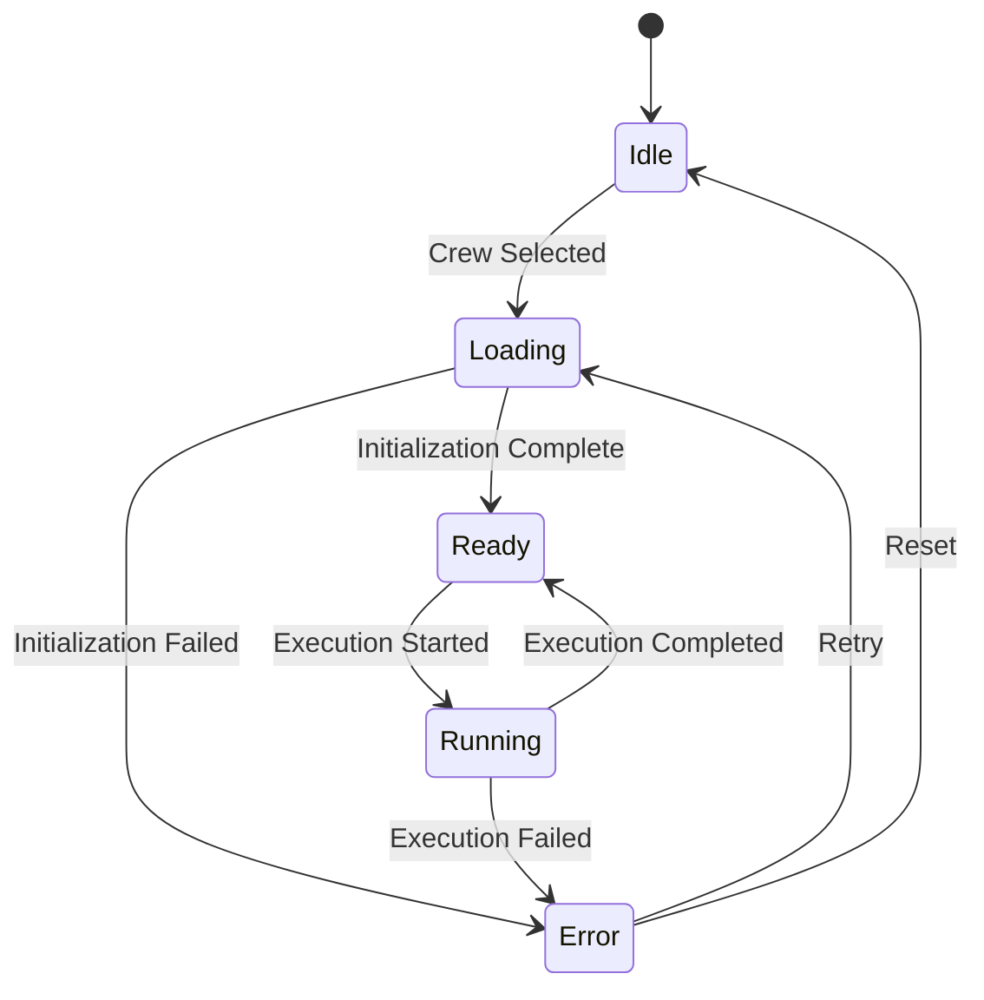

# Crew Initialization & Visualization Improvement Plan

## Current Architecture Analysis

### Strengths
1. **Event-Driven Architecture**: Well-structured event system using CrewAI's event bus
2. **Real-time Updates**: WebSocket-based communication for live updates
3. **Modular Design**: Separation of concerns between visualization, events, and crew execution

### Limitations
1. **Crew Initialization**: No clear initialization flow when switching crews
2. **State Management**: Crew state isn't properly reset between executions
3. **Error Handling**: Limited error recovery during crew switching
4. **Visual Feedback**: Minimal feedback during crew loading and initialization

## Proposed Architecture

### 1. Enhanced Crew Initialization Flow

#### 1.1 Crew Initialization States
```typescript
type CrewInitializationState = {
  status: 'idle' | 'loading' | 'ready' | 'error';
  currentCrewId: string | null;
  error: string | null;
  initializationTime: number | null;
  lastInitializedAt: Date | null;
};
```

#### 1.2 Initialization Sequence
1. **Crew Selection**: User selects a crew from the UI
2. **Pre-Initialization**:
   - Reset visualization state
   - Clear previous crew data
   - Show loading state
3. **Crew Loading**:
   - Fetch crew definition
   - Validate crew configuration
   - Initialize required agents and tasks
4. **WebSocket Connection**:
   - Establish WebSocket connection
   - Register for crew-specific events
   - Confirm connection
5. **Ready State**:
   - Enable run button
   - Display crew details
   - Show initialization metrics

### 2. Improved State Management

#### 2.1 State Store Structure
```typescript
interface CrewStateStore {
  activeCrew: {
    id: string;
    name: string;
    status: CrewStatus;
    initializedAt: Date | null;
  };
  agents: Record<string, AgentState>;
  tasks: Record<string, TaskState>;
  visualization: {
    nodes: Node[];
    edges: Edge[];
    viewport: Viewport;
  };
  execution: {
    isRunning: boolean;
    startTime: Date | null;
    endTime: Date | null;
    currentStep: number;
    totalSteps: number;
  };
}
```

#### 2.2 State Transitions


### 3. Enhanced Visualization Layer

#### 3.1 Visualization Components
1. **CrewGraph**: Main visualization component
   - Handles layout and rendering
   - Manages viewport and zoom
   - Handles node interactions

2. **Node Types**:
   - CrewNode: Represents the crew with overall status
   - AgentNode: Shows agent state and details
   - TaskNode: Displays task status and outputs

3. **Edge Types**:
   - ExecutionFlow: Shows execution order
   - DataFlow: Shows data dependencies
   - Hierarchy: Shows crew-agent-task relationships

#### 3.2 Visualization States
```typescript
interface VisualizationState {
  // Layout
  layout: 'hierarchical' | 'sequential' | 'radial';
  
  // Display Options
  showTaskOutputs: boolean;
  showAgentDetails: boolean;
  showCompletedTasks: boolean;
  
  // Interaction
  selectedNode: string | null;
  hoveredNode: string | null;
  
  // Performance
  animationEnabled: boolean;
  renderQuality: 'low' | 'medium' | 'high';
}
```

### 4. Event System Enhancements

#### 4.1 New Events
```typescript
// Crew Initialization Events
class CrewInitializationStartedEvent(BaseEvent):
    crew_id: str
    crew_name: str
    timestamp: datetime

class CrewInitializationCompletedEvent(BaseEvent):
    crew_id: str
    crew_name: str
    duration_ms: float
    success: bool
    error: Optional[str]

// Crew Execution Events
class CrewExecutionStartedEvent(BaseEvent):
    crew_id: str
    inputs: Dict[str, Any]
    timestamp: datetime

class CrewExecutionCompletedEvent(BaseEvent):
    crew_id: str
    outputs: Dict[str, Any]
    duration_ms: float
    success: bool
    error: Optional[str]
```

#### 4.2 Event Flow
1. **Initialization Phase**:
   - `CrewInitializationStarted`
   - `AgentsInitialized`
   - `TasksInitialized`
   - `CrewInitializationCompleted`

2. **Execution Phase**:
   - `CrewExecutionStarted`
   - `TaskStarted`
   - `TaskCompleted`
   - `AgentExecutionStarted`
   - `AgentExecutionCompleted`
   - `CrewExecutionCompleted`

### 5. Implementation Plan

#### Phase 1: Core Infrastructure (Week 1)
1. Implement enhanced state management
2. Create initialization service
3. Update event system with new events
4. Add error handling and recovery

#### Phase 2: Visualization (Week 2)
1. Implement new visualization components
2. Add layout algorithms
3. Implement state persistence
4. Add performance optimizations

#### Phase 3: Integration & Testing (Week 3)
1. Integrate with existing UI
2. Add comprehensive tests
3. Performance benchmarking
4. User acceptance testing

### 6. Error Handling & Recovery

#### 6.1 Error Types
1. **Initialization Errors**:
   - Invalid crew configuration
   - Missing dependencies
   - Network issues

2. **Execution Errors**:
   - Task failures
   - Agent errors
   - Timeouts

#### 6.2 Recovery Strategies
1. **Automatic Recovery**:
   - Retry failed operations
   - Fallback to cached data
   - Degrade gracefully

2. **User Intervention**:
   - Clear error messages
   - Recovery suggestions
   - Debug information

### 7. Performance Considerations

#### 7.1 Optimization Strategies
1. **Lazy Loading**:
   - Load crew details on demand
   - Virtualize large lists
   - Defer non-critical rendering

2. **Caching**:
   - Cache crew definitions
   - Store execution history
   - Optimize WebSocket messages

3. **Rendering**:
   - Use React.memo for components
   - Implement windowing for large lists
   - Optimize re-renders

### 8. Testing Strategy

#### 8.1 Unit Tests
- State management
- Event handlers
- Utility functions

#### 8.2 Integration Tests
- Crew initialization
- Event flow
- State transitions

#### 8.3 E2E Tests
- User workflows
- Error scenarios
- Performance testing

## Conclusion

This plan outlines a comprehensive approach to improving crew initialization and visualization. The key improvements include:

1. **Robust Initialization**: Clear flow for crew loading and setup
2. **Enhanced State Management**: Better handling of crew and execution state
3. **Improved Visualization**: More informative and interactive UI
4. **Better Error Handling**: Comprehensive error recovery
5. **Performance Optimizations**: Smoother user experience

By implementing these changes, we'll create a more reliable and user-friendly experience for working with crews in the CrewAI Playground.
